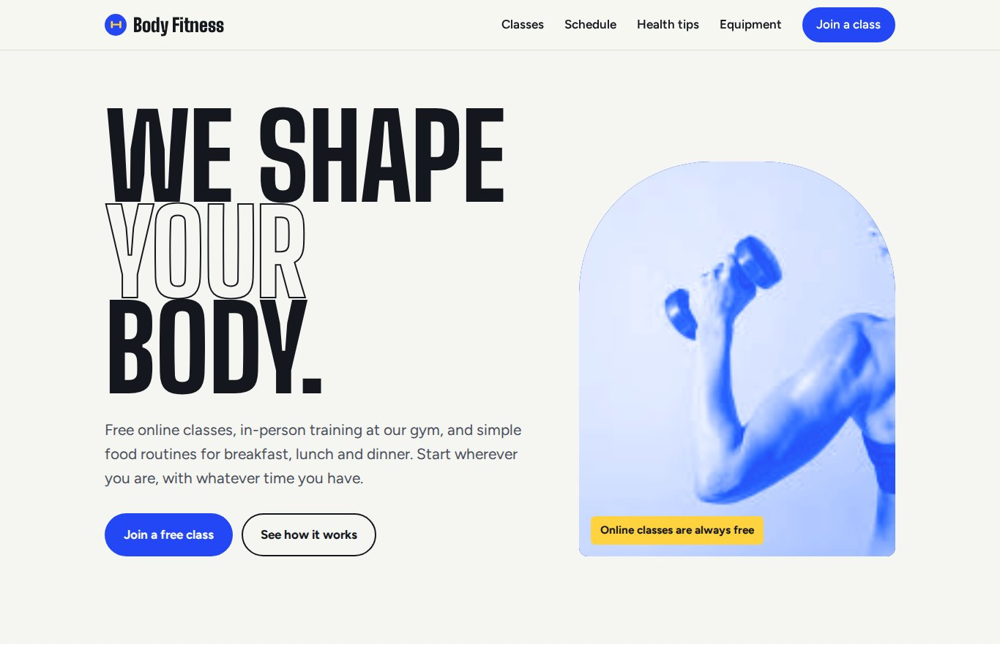
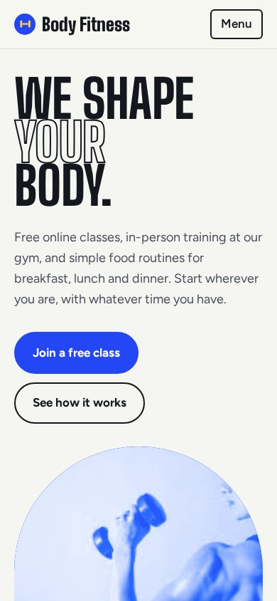
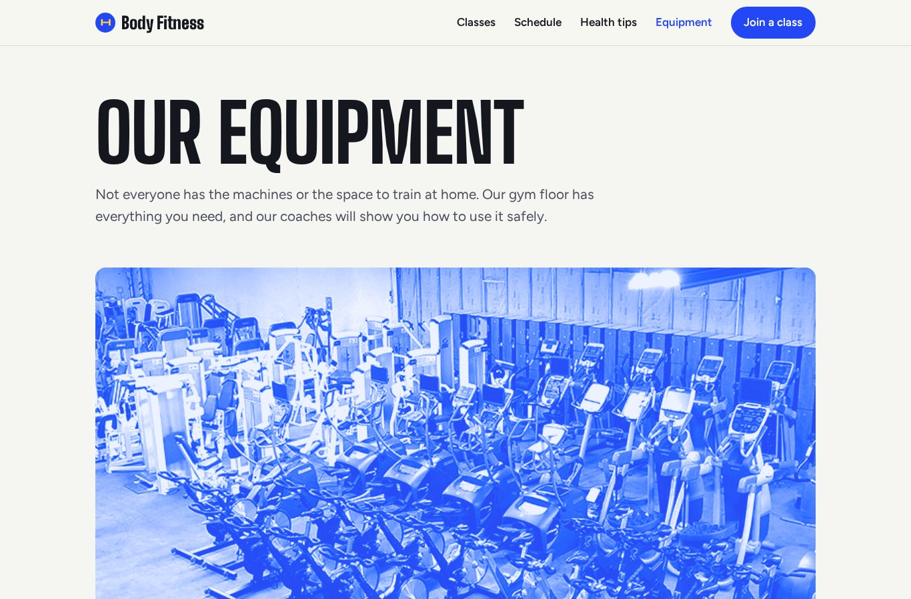
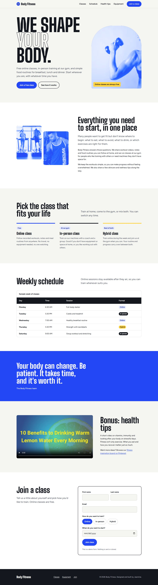

# Body Fitness Website

A responsive, two-page website for **Body Fitness**, a fitness brand offering free online classes, in-person gym sessions, and simple food routines. Built with plain HTML, CSS and JavaScript, no frameworks.

**Live demo:** [mjeannine.github.io/body-fitness-website](https://mjeannine.github.io/body-fitness-website/)



---

## Table of contents

- [About the project](#about-the-project)
- [Features](#features)
- [Screenshots](#screenshots)
- [Built with](#built-with)
- [Project structure](#project-structure)
- [Run it locally](#run-it-locally)
- [Deploy with GitHub Pages](#deploy-with-github-pages)
- [Project history](#project-history)
- [What I learned](#what-i-learned)
- [Future improvements](#future-improvements)
- [Credits](#credits)
- [Author](#author)

## About the project

Many people want to get fit but don't know where to start: what to eat, what to avoid, and which exercises are right for them. Body Fitness is a website for a fitness brand that answers those questions and invites visitors to join a class.

The site offers three ways to train:

| Class | How it works |
|---|---|
| Online (free) | Recorded workouts, notes and meal routines you can follow anywhere |
| In-person | Training at the gym, with machines and a coach |
| Hybrid | A mix of online and in-person sessions |

The site has two pages:

- **Home (`index.html`)**: introduction, class types, weekly schedule, a health-tips video, and a sign-up form.
- **Equipment (`materials.html`)**: the gym floor, cardio machines and strength equipment.

## Features

- **Responsive layout** that works on phones, tablets and desktops, using CSS Grid and Flexbox
- **Mobile navigation menu** with an accessible toggle button
- **Consistent two-tone photo style** created with CSS blend modes, so photos from different sources look like one brand
- **Weekly schedule table** that scrolls horizontally on small screens instead of breaking the layout
- **Interactive sign-up form** with validation, custom radio buttons, a date picker that blocks past dates, and a confirmation message (front-end demo only; no data is sent)
- **Embedded video** with a poster image and lazy loading, so the page loads fast
- **Accessibility**: semantic HTML, skip link, alt text on every image, visible keyboard focus, labelled form fields, and reduced motion for people who turn off animations
- **SEO and sharing**: page descriptions, Open Graph tags, and a custom favicon

## Screenshots

| Desktop | Mobile |
|---|---|
|  |  |

**Equipment page**



<details>
<summary>Full home page</summary>



</details>

## Built with

- **HTML5**: semantic structure (`header`, `nav`, `main`, `section`, `figure`, `footer`)
- **CSS3**: custom properties (variables), Grid, Flexbox, `clamp()` for fluid type, blend modes, media queries
- **JavaScript (vanilla)**: menu toggle, form handling, date limits
- **Google Fonts**: [Big Shoulders Display](https://fonts.google.com/specimen/Big+Shoulders+Display) for headings and [Figtree](https://fonts.google.com/specimen/Figtree) for body text

### Design choices

| Token | Value | Used for |
|---|---|---|
| Chalk | `#f5f6f1` | Page background |
| Ink | `#15171f` | Text, dark sections |
| Cobalt | `#2447f5` | Brand color, buttons, photo tint |
| Sun | `#ffd23f` | Highlights and focus outlines |

The condensed display font is inspired by gym and stadium signage. The cobalt tint on every photo gives the site one consistent look.

## Project structure

```
body-fitness-website/
├── index.html              # Home page
├── materials.html          # Equipment page
├── assets/
│   ├── css/
│   │   └── style.css       # All styles, shared by both pages
│   ├── js/
│   │   └── main.js         # Menu, form and small interactions
│   ├── images/
│   │   ├── favicon.svg
│   │   ├── gym-floor.jpg
│   │   ├── treadmill-class.jpg
│   │   ├── dumbbell-curl.jpg
│   │   ├── weight-room.jpg
│   │   └── video-poster.jpg
│   └── video/
│       └── health-tips.mp4
├── docs/                   # Screenshots used in this README
└── README.md
```

## Run it locally

No installation or build step is needed.

1. Clone the repository:
   ```bash
   git clone https://github.com/mjeannine/body-fitness-website.git
   ```
2. Open the folder:
   ```bash
   cd body-fitness-website
   ```
3. Open `index.html` in your browser. You can double-click the file, or use the **Live Server** extension in VS Code for automatic reloading.

## Deploy with GitHub Pages

1. Go to the repository's **Settings** tab.
2. Click **Pages** in the left sidebar.
3. Under **Build and deployment**, set **Source** to **Deploy from a branch**.
4. Choose the **main** branch and the **/ (root)** folder, then click **Save**.
5. After a minute or two, the site is live at `https://mjeannine.github.io/body-fitness-website/`.

## Project history

This project started in 2021 as a school web design assignment, where I practised the basics of HTML: headings, lists, links, images, tables, forms and video.

In 2026 I redesigned it into a modern, mobile-friendly site. The main changes:

- Reorganized the files into a clear folder structure with descriptive names
- Rewrote the HTML with correct, semantic structure (the original had duplicate tags and misplaced elements)
- Moved all styling into one shared stylesheet and added a full visual design
- Made every page responsive for mobile
- Fixed the video, which didn't play online because of a mismatch between the file name and the link
- Replaced a table of personal contact details with a class schedule, to protect people's privacy
- Added accessibility features and a working form interaction

## What I learned

- How to structure a website with semantic HTML so it's readable for people and search engines
- How to build responsive layouts with CSS Grid, Flexbox and media queries
- How to keep a design consistent with CSS variables
- How to make a site more accessible for keyboard and screen reader users
- How file paths and letter case matter when a site is hosted online

## Future improvements

- Connect the sign-up form to a real service (for example Formspree or Google Forms)
- Add a page with meal routines for breakfast, lunch and dinner
- Add a class booking calendar
- Add a dark mode

## Credits

The photos and video are used for educational, non-commercial purposes. All rights belong to their original owners. Fitness inspiration: [Pinterest board](https://in.pinterest.com/sdhanasari/fitness-and-gym/).

## Author

**Jeannine**
GitHub: [@mjeannine](https://github.com/mjeannine)

If you have feedback or ideas, feel free to open an issue.
